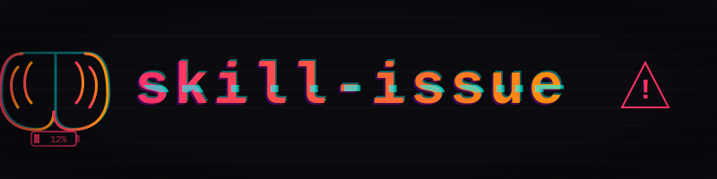
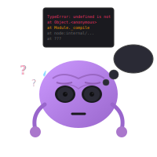
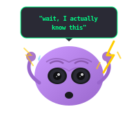
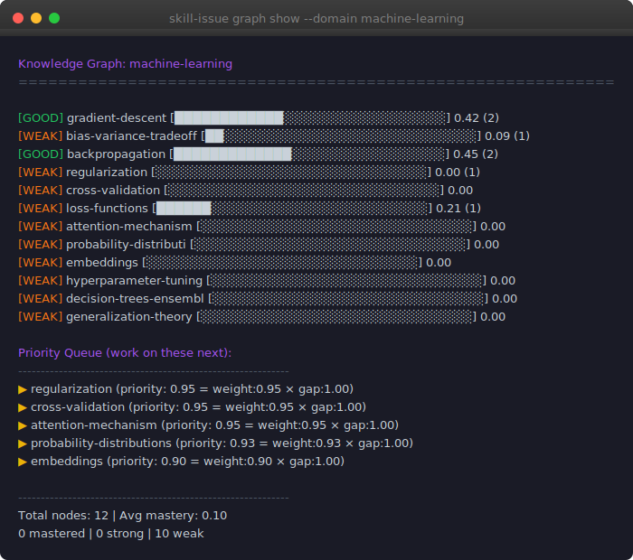
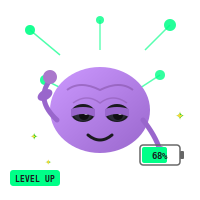

<div align="center">



<p>
  <a href="https://pypi.org/project/skill-issue-cc/"></a>
  <a href="https://github.com/SnehalRaj/skill-issue/blob/main/LICENSE"></a>
  <a href="https://github.com/SnehalRaj/skill-issue/stargazers"></a>
  
  
  <a href="https://github.com/SnehalRaj/skill-issue/actions"></a>
</p>

**When's the last time you solved a problem without asking first?**


</div>


The last time you debugged something without asking first was—

You're shipping faster. Or you think you are.

---

## The Accumulation



METR ran an RCT on experienced open-source developers: AI users took 19% longer. They believed they were 20% faster.<sup>[1]</sup> That's a 39-point perception gap, and it persisted even after subjects saw their own data.

GitHub's research didn't measure whether developers *were* more productive—they asked if developers *felt* more productive.<sup>[5]</sup> The answer was barely. Anthropic measured what you're actually losing: comprehension decays faster than you'd expect, and reviewing AI-generated code gives you "flimsy understanding."<sup>[2]</sup> The tests pass. You don't notice.

It's not one study. The 2024 DORA report found no productivity signal.<sup>[3]</sup> Trust in AI tool output dropped from 43% to 33% in a single year—even developers stopped trusting it.<sup>[4]</sup>

---

## It's Not Just You

On r/ExperiencedDevs, seniors are watching juniors who say "clean coding is not a real thing" and use AI to write PR review responses without reading them.<sup>[8]</sup> Another thread: juniors can't explain why AI-generated code is wrong, even when it "works."<sup>[9]</sup>

It's not just juniors. A senior ML engineer with 9 YoE: "Is senior ML engineering just API calls now?"<sup>[10]</sup> A 40-year veteran documenting his first all-AI project found the ambiguity had shifted somewhere he couldn't follow.<sup>[11]</sup>

Godot maintainers are drowning in "AI slop" contributions. One said: "I don't know how long we can keep it up."<sup>[12]</sup>

---



## The Tool

skill-issue embeds micro-challenges directly into your agentic workflow. You ship code with Claude, then get quizzed on what just happened. Not trivia. Not LeetCode. The actual concepts in the code you just approved.



Your knowledge lives in a graph. Nodes are concepts—weighted by how often they appear across real codebases. Edges connect prerequisites. Every challenge updates your mastery scores using spaced repetition: get it right, the node strengthens; get it wrong, it surfaces more often. The system knows what you're weak on before you do.

---

## Install

```bash
pip install skill-issue-cc
skill-issue init
```

That's it.

---

## Challenge Types

| | Type | What it tests |
|---|---|---|
| 📝 | **Pen & Paper** | Can you compute this by hand? |
| 🗣️ | **Explain Back** | Can you explain *why* this works? |
| 🔮 | **Predict** | What does this function return? |
| 🐛 | **Spot the Bug** | Here's a broken version — find it |
| ⏱️ | **Complexity** | What's the Big-O? Can it be better? |
| 🔗 | **Connect** | How does this relate to X? |

Grounded in what was just built. No random trivia.

---

## Commands

| Command | What it does |
|---|---|
| `skill-issue init` | Onboarding + profile setup |
| `skill-issue stats` | XP, level, streak, topic breakdown |
| `skill-issue graph show --domain <d>` | ASCII viz |
| `skill-issue graph weak --domain <d>` | Top priority nodes |
| `skill-issue graph web --domain <d>` | D3 force graph in browser |
| `skill-issue graph domains` | List available domains |
| `skill-issue graph update --node <n> --score <0-3> --domain <d>` | Update mastery |
| `skill-issue report` | Regenerate trophy wall |
| `skill-issue export --format json` | Export history |

**Voice commands** (say to your agent):

| Say | Does |
|---|---|
| `my stats` / `trophy wall` | Show profile |
| `show graph` / `show brain` | Visualize knowledge |
| `challenge me` | Force a challenge |
| `harder` / `easier` | Shift difficulty ±1 |
| `focus mode` | Pause challenges |
| `hint` / `skip` | Hint (0.75× XP) / skip |

---

## Domains

| Domain | Nodes | Covers |
|---|---|---|
| `machine-learning` | 12 | Gradient descent, backprop, transformers, bias-variance |
| `computer-science` | 12 | Complexity, DP, trees/graphs, concurrency, OS |
| `algorithms` | 8 | Sorting, binary search, DP, graph traversal |
| `quantum-ml` | 14 | Variational circuits, parameter shift, barren plateaus |
| `web-frontend` | 10 | Event loop, closures, promises, DOM, CSS |
| `backend-systems` | 10 | Indexing, ACID, caching, distributed systems |
| `devops` | 8 | Containers, Kubernetes, CI/CD, IaC, GitOps |
| `design-systems` | 8 | Visual hierarchy, design tokens, typography, WCAG |
| `mobile` | 8 | App lifecycle, state, navigation, offline-first |

Add your own in `references/knowledge_graphs/`.

---



## Progression

```
XP = base × difficulty × streak_multiplier
```

| Score | Meaning | Base XP |
|---|---|---|
| 0 | Wrong / Skipped | 0 |
| 1 | Partial | 5 |
| 2 | Correct | 12 |
| 3 | Exceptional | 20 |

Difficulty multipliers: Apprentice 1× → Practitioner 1.5× → Expert 2× → Master 3×

Streak bonus tops out at 2.5× for consecutive correct answers.

---

## Knowledge Graph

Each domain has a curated graph of concepts weighted by how often they come up in real work.

- **reuse_weight** (0–1): How fundamental. 0.95 means it's everywhere.
- **mastery** (0–1): Your proven understanding. Updates via EMA after each challenge.
- **priority** = `weight × (1 - mastery)`. High-weight stuff you haven't proven = top priority.

Mastery fades if you don't practice (3-day grace, then 0.02/day). Use it or lose it.

---

## Persistent State

```
~/.skill-issue/
├── profile.json           # XP, streak, topic levels, milestones
├── config.yaml            # frequency, domains, difficulty bias
├── knowledge_state.json   # per-node mastery for all domains
├── leaderboard.md         # your trophy wall
└── sessions/              # per-session challenge logs
    └── 2026-02-27.json
```

Plain JSON/YAML. Version-controllable. No database.

---

## Further Reading

1. [METR, "AI Experienced OS Devs Study" (2025)](https://metr.org/Early_2025_AI_Experienced_OS_Devs_Study.pdf) — RCT: experienced developers 19% slower with AI, believed they were 20% faster.

2. [Anthropic, "The Impact of AI on Developer Productivity" (2026)](https://arxiv.org/abs/2601.20245) — No significant speed-up; AI coding "significantly lowers comprehension of the codebase."

3. DORA Report 2024 — AI tools showed no measurable productivity signal.

4. [LeadDev, "Trust in AI Coding Tools Is Plummeting" (2025)](https://leaddev.com/technical-direction/trust-in-ai-coding-tools-is-plummeting) — 33% trust in 2025, down from 43% in 2024.

5. [LeadDev, "AI Coding Assistants Aren't Really Making Devs Feel More Productive" (2025)](https://leaddev.com/velocity/ai-coding-assistants-arent-really-making-devs-feel-more-productive) — GitHub's research measured feelings, not output—and still found minimal gains.

6. [Claude on Upwork Benchmark (2025)](https://reddit.com/r/MachineLearning) — Resolved 26.2% of real-world software engineering tasks.

7. ["Competence as Tragedy"](https://crowprose.com/blog/competence-as-tragedy) — Personal essay on watching AI make hard-won skills obsolete.

8. [r/ExperiencedDevs, "Junior devs not interested in software engineering" (2025)](https://reddit.com/r/ExperiencedDevs/comments/1mrfgm2) — 1,795 upvotes. Seniors observing juniors who've never heard of Coursera, say "clean coding is not a real thing."

9. [r/ExperiencedDevs, "ChatGPT is producing bad and lazy junior engineers" (2025)](https://reddit.com/r/ExperiencedDevs/comments/1lb5ktb) — 1,449 upvotes. Juniors can't explain why AI code is wrong.

10. [r/MachineLearning, "Is senior ML engineering just API calls now?" (2025)](https://reddit.com/r/MachineLearning/comments/1npdfh1) — 9 YoE engineer feeling career stagnation.

11. ["Vibe Coding as a Coding Veteran"](https://medium.com/gitconnected/vibe-coding-as-a-coding-veteran-cd370fe2be50) — 40-year veteran, PhD in AI, documenting 2 weeks building entirely through AI conversation.

12. [PCGamer, "Godot drowning in 'AI slop' contributions" (2025)](https://pcgamer.com) — Maintainer: "I don't know how long we can keep it up." 2,963 upvotes on r/programming.

13. Ilya Sutskever on the gap between AI benchmarks and economic impact (2025) — Even AI's believers can't explain why gains aren't translating.

---

## Philosophy

This is not a productivity tool. Your productivity is fine. It's your brain we're worried about.

You hired a brilliant assistant who never explains anything. Now you're the person who can't do their job without them. The name is the bit. Claude has skills. The question is whether you still do.

Ilya Sutskever—one of AI's true believers—said he's puzzled why benchmark gains aren't translating to economic impact.<sup>[13]</sup> A personal essay called it "competence as tragedy": watching your hard-won skills become vestigial.<sup>[7]</sup>

The tools work. That's the problem. They work well enough that you stop working *at all*.

---

## Contributing

Knowledge graphs are JSON in `references/knowledge_graphs/`. PRs welcome.

See [CONTRIBUTING.md](CONTRIBUTING.md).

**MIT License**

---

<div align="center"><sub>Works with Claude Code · Cursor · Codex · any agent that reads a system prompt</sub></div>
