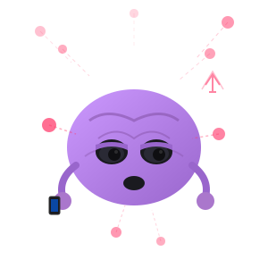

<div align="center">


<p>
  <a href="https://pypi.org/project/skill-issue-cc/"></a>
  <a href="https://github.com/SnehalRaj/skill-issue/blob/main/LICENSE"></a>
  <a href="https://github.com/SnehalRaj/skill-issue/stargazers"></a>
  
  
  <a href="https://github.com/SnehalRaj/skill-issue/actions"></a>
</p>

**When's the last time you solved a problem without asking first?**


</div>



You mass-accepted 200 Copilot suggestions last month. Quick: what's the time complexity of the sort you're using in production?

Somewhere between "let me just ask Claude" and "wait, how does this work again," your debugging muscle quietly atrophied. You didn't notice. You were shipping.

METR ran a study. Experienced developers using AI coding tools took 19% longer to complete tasks. They thought they were 20% faster. That's a 39-point gap between perception and reality. Anthropic found something worse: the more you use AI for code, the less you understand the code you're shipping. Comprehension decays faster than you'd expect, and you don't feel it happening because the tests still pass.

The gap between what you think is happening and what's actually happening is called skill-issue.

---

skill-issue embeds micro-challenges directly into your agentic workflow. You ship code with Claude, then get quizzed on what just happened. Not trivia. Not LeetCode. The actual concepts in the code you just approved.


Your knowledge lives in a graph. Nodes are concepts—weighted by how often they appear across real codebases. Edges connect prerequisites. Every challenge updates your mastery scores using spaced repetition: get it right, the node strengthens; get it wrong, it surfaces more often. The system knows what you're weak on before you do.

## Install

```bash
pip install skill-issue-cc
skill-issue init
```

That's it.

## Challenges

| Type | What it tests |
|------|---------------|
| **Explain** | Describe what a code block does in plain English |
| **Predict** | What's the output? What error will this throw? |
| **Debug** | Here's a bug. Find it. |
| **Refactor** | Make this better. Justify your changes. |
| **Trace** | Walk through execution step by step |

Every challenge is about the code you just shipped. The thing you just let Claude write.

## Commands

| Command | What it does |
|---------|--------------|
| `skill-issue challenge` | Generate a challenge from recent context |
| `skill-issue stats` | Your current mastery scores |
| `skill-issue graph show` | Render your knowledge graph |
| `skill-issue graph weak` | Show your weakest nodes |
| `skill-issue review` | Queue of concepts due for review |

## Philosophy

This is not a productivity tool. Your productivity is fine. It's your brain we're worried about.

You hired a brilliant assistant who never explains anything. Now you're the person who can't do their job without them. That's not a skill issue—wait, no, that's exactly what that is.

The name is the bit. Claude has skills. The question is whether you still do.

---

## Knowledge Graph

Each domain has a curated graph of concepts weighted by how often they come up in real work.

- **reuse_weight** (0–1): How fundamental. 0.95 means it's everywhere.
- **mastery** (0–1): Your proven understanding. Updates via EMA after each challenge.
- **priority** = `weight × (1 - mastery)`. High-weight stuff you haven't proven = top priority.

Mastery fades if you don't practice (3-day grace, then 0.02/day). Use it or lose it.

---

## Onboarding

```
skill-issue init

3 questions to personalise your knowledge graph.

1. What do you mainly build or work on?
   > I train ML models and do some backend API work

2. What languages or tools do you use most?
   > Python, PyTorch, FastAPI, PostgreSQL

3. One concept you know you are shaky on? (optional)
   > always forget when cross-validation goes wrong

Knowledge graphs initialised for: machine-learning, backend-systems, algorithms
```

Three questions. It figures out which domains to load.

---

## Challenge Types

| | Type | What it tests |
|---|---|---|
| 📝 | **Pen & Paper** | Can you compute this by hand? |
| 🗣️ | **Explain Back** | Can you explain *why* this works? |
| 🔮 | **Predict** | What does this function return? |
| 🐛 | **Spot the Bug** | Here's a broken version — find it |
| ⏱️ | **Complexity** | What's the Big-O? Can it be better? |
| 🔗 | **Connect** | How does this relate to X? |

Grounded in what was just built. No random trivia.

---

## Full Commands

| Command | What it does |
|---|---|
| `skill-issue init` | Onboarding + profile setup |
| `skill-issue stats` | XP, level, streak, topic breakdown |
| `skill-issue graph show --domain <d>` | ASCII viz |
| `skill-issue graph weak --domain <d>` | Top priority nodes |
| `skill-issue graph web --domain <d>` | D3 force graph in browser |
| `skill-issue graph domains` | List available domains |
| `skill-issue graph update --node <n> --score <0-3> --domain <d>` | Update mastery |
| `skill-issue report` | Regenerate trophy wall |
| `skill-issue export --format json` | Export history |

**Voice commands** (say to your agent):

| Say | Does |
|---|---|
| `my stats` / `trophy wall` | Show profile |
| `show graph` / `show brain` | Visualize knowledge |
| `challenge me` | Force a challenge |
| `harder` / `easier` | Shift difficulty ±1 |
| `focus mode` | Pause challenges |
| `hint` / `skip` | Hint (0.75× XP) / skip |

---

## Domains

| Domain | Nodes | Covers |
|---|---|---|
| `machine-learning` | 12 | Gradient descent, backprop, transformers, bias-variance |
| `computer-science` | 12 | Complexity, DP, trees/graphs, concurrency, OS |
| `algorithms` | 8 | Sorting, binary search, DP, graph traversal |
| `quantum-ml` | 14 | Variational circuits, parameter shift, barren plateaus |
| `web-frontend` | 10 | Event loop, closures, promises, DOM, CSS |
| `backend-systems` | 10 | Indexing, ACID, caching, distributed systems |
| `devops` | 8 | Containers, Kubernetes, CI/CD, IaC, GitOps |
| `design-systems` | 8 | Visual hierarchy, design tokens, typography, WCAG |
| `mobile` | 8 | App lifecycle, state, navigation, offline-first |

Add your own in `references/knowledge_graphs/`.

---

## Progression

```
XP = base × difficulty × streak_multiplier
```

| Score | Meaning | Base XP |
|---|---|---|
| 0 | Wrong / Skipped | 0 |
| 1 | Partial | 5 |
| 2 | Correct | 12 |
| 3 | Exceptional | 20 |

Difficulty multipliers: Apprentice 1× → Practitioner 1.5× → Expert 2× → Master 3×

Streak bonus tops out at 2.5× for consecutive correct answers.

---

## Persistent State

```
~/.skill-issue/
├── profile.json           # XP, streak, topic levels, milestones
├── config.yaml            # frequency, domains, difficulty bias
├── knowledge_state.json   # per-node mastery for all domains
├── leaderboard.md         # your trophy wall
└── sessions/              # per-session challenge logs
    └── 2026-02-27.json
```

Plain JSON/YAML. Version-controllable. No database.

---

## Contributing

Knowledge graphs are JSON in `references/knowledge_graphs/`. PRs welcome.

See [CONTRIBUTING.md](CONTRIBUTING.md).

**MIT License**

---

<div align="center">
  <sub>Works with Claude Code · Cursor · Codex · OpenCode · any agent that reads a system prompt</sub>
</div>
